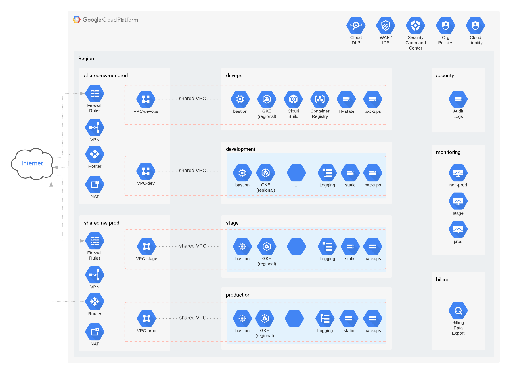

This content is provided by the team at [DoiT International](https://doit-intl.com), a global product and service organization dedicated to making the public cloud accessible while secure for all.

# Secure configuration example

# Checklists
## Initial setup
- [ ] Configure org policies
  - [ ] Restrict allowed IAM domains
  - [ ] Disable SA key creation
  - [ ] Disable SA key upload
  - [ ] Skip default network
  - [ ] Disable external IPs
  - [ ] Restrict prod networks to folder
  - [ ] Require shielded VM
  - [ ] Require OSLogin
  - [ ] Require uniform bucket access
  - [ ] Disable lein removal
- [ ] Prepare for VPC service controls (data protection)
  - [ ] Create access policy (one per org)
- [ ] Disable org-level roles
  - [ ] Billing admin
  - [ ] Project creator
- [ ] Define disaster recovery plan
  - [ ] DR team and contacts
  - [ ] Geographical regions
  - [ ] RTO, RPO
  - [ ] Data backups
  - [ ] Configuration management
  - [ ] Continuous deployment
  - [ ] Test schedule (at least annual)
- [ ] Establish user groups in GSuite / Cloud Identity
  - [ ] Organization Admin
  - [ ] Network Admin
  - [ ] Security Admin
  - [ ] Billing Admin
  - [ ] Devops
  - [ ] Developers
  - [ ] Data Scientists
  - [ ] Contractors
  - [ ] Teams (project or folder-level as you grow)
- [ ] Establish resource hierarchy
  - [ ] Define folder and project hierarchy
  - [ ] Define environment data security perimeters (VPC service controls)
  - [ ] Set up IAM permissions
    - [ ] Billing
    - [ ] Org
      - [ ] Folder
        - [ ] Project
    - *Tips:*
      - [ ] assign **only groups** IAM roles (not users)
      - [ ] use `conditions` where possible to limit access scope
      - [ ] set minimal permissions at each level as needed
      - [ ] highest permission `Editor` for any project
  - [ ] Set up Network
    - [ ] Document IP address ranges (IPAM)
      - [ ] Clusters
        - [ ] secondary ranges
      - [ ] VMs
      - [ ] Databases
      - [ ] Connectors
      - [ ] Managed services
      - [ ] Bastion (jump host)
    - [ ] Create shared VPC (host project)
      - [ ] VPCs
        - [ ] Subnets
        - [ ] Firewall rules
      - [ ] Cloud Router
      - [ ] NAT
    - [ ] Serverless VPC Connector
  - [ ] Set up Security project
    - [ ] Enable audit logging at org level
    - [ ] Create audit logging storage bucket
    - [ ] Create aggregated audit log sinks to security project
  - [ ] Set up Devops project
    - [ ] Override key download policy (for this project)
    - [ ] Create Terraform service account(s)
      - [ ] Admin
      - [ ] Developer (optional)
    - [ ] Create artifact registry
      - [ ] Service account permissions
      - [ ] Container analysis
      - [ ] Binary authorization
    - [ ] Cloud Build
      - [ ] Service account permissions
      - [ ] Connect Git repositories
  - [ ] Set up Billing project
    - [ ] Create BigQuery dataset to store billing data
    - [ ] Create billing export to bq dataset (only 1 per billing ID)
    - [ ] Define resource labeling plan
  - [ ] Set up Monitoring project
    - [ ] Create initial workspace and add projects above
    - [ ] Create logging bucket(s)
    - [ ] Create notification channels
- [ ] Set up monitoring / alerts
  - [ ] Billing / budget alerts
  - [ ] [CIS Benchmarks](https://gist.github.com/mikesparr/3408145208716ba821d51aa9d10c1650)

## Project considerations
- [ ] Add project leins to prevent accidental deletion (i.e. production)
- [ ] Audit log sink to `security` project
- [ ] Log sink to `monitoring` project logging bucket
  - [ ] Add exclusion filters or disable `_Default`
- [ ] Ensure network resources available
  - [ ] Plan out or request network resources from shared VPC
  - [ ] Add as service project
- [ ] Set up Service Accounts
  - [ ] CI/CD
  - [ ] Cache
  - [ ] Database
  - [ ] Storage
  - [ ] App Runtime
- [ ] Add only permissions required for tasks
- [ ] OS Login
- [ ] Considerations:
  - [ ] Storage bucket policy and lifecycle
  - [ ] Data replications and RPO
  - [ ] Data security perimeter
  - [ ] Data loss prevention and PII
  - [ ] Label resources
  - [ ] Quotas
  - [ ] Cloud IAP
  - [ ] Firewall rules
  - [ ] Monitoring
    - [ ] Uptime checks
    - [ ] Define SLO / SLI
    - [ ] Dashboards
    - [ ] Alerts

# Helpful links
- [Best practices for enterprise](https://cloud.google.com/docs/enterprise/best-practices-for-enterprise-organizations)
- [GCP for AWS professionals](https://cloud.google.com/docs/compare/aws)
- [Identity best practices](https://cloud.google.com/architecture/identity/best-practices-for-planning)
- [Inter-region latency and throughput](https://datastudio.google.com/u/0/reporting/fc733b10-9744-4a72-a502-92290f608571/page/70YCB)
- [Lowest-latency region check](https://gcping.com)
- [Creating organizations](https://cloud.google.com/resource-manager/docs/creating-managing-organization)
- [Migrating projects to org](https://cloud.google.com/resource-manager/docs/migrating-projects-billing)
- [Migrating projects from org](https://cloud.google.com/resource-manager/docs/project-migration)
- [GSuite and Cloud Identity](https://cloud.google.com/identity)
- [Enforce MFA login](https://cloud.google.com/identity/solutions/enforce-mfa)
- [Service account keys best practices](https://medium.com/@jryancanty/stop-downloading-google-cloud-service-account-keys-1811d44a97d9)
- [Log exports for compliance](https://cloud.google.com/solutions/exporting-stackdriver-logging-for-compliance-requirements)
- [Log exclusion filters](https://cloud.google.com/logging/docs/exclusions)
- [Centralize logs across projects](https://blog.doit-intl.com/centralize-logs-from-multiple-projects-on-google-cloud-platform-79aa7256ed0a)
- [Storage object lifecycles](https://cloud.google.com/storage/docs/lifecycle)
- [Monitoring and workspaces](https://cloud.google.com/monitoring/workspaces)
- [Request Annotation with logging](https://medium.com/google-cloud/request-annotation-with-cloud-audit-logging-and-monitoring-on-gcp-ce8e8671c086) 
- [Service monitoring (SLO/SLI)](https://cloud.google.com/service-monitoring)
- [Disaster recovery](https://cloud.google.com/solutions/dr-scenarios-planning-guide)
- [Velero Kubernetes backups](https://blog.doit-intl.com/google-kubernetes-engine-cluster-migration-with-velero-4a140b018f32)
- [Project liens](https://cloud.google.com/resource-manager/docs/project-liens)
- [Labeling best practices](https://blog.doit-intl.com/google-cloud-platform-resource-labeling-best-practices-66fded7ba57)
- [Billing data exports](https://cloud.google.com/billing/docs/how-to/export-data-bigquery)
- [VPC service controls](https://cloud.google.com/vpc-service-controls)
- [Data loss prevention](https://cloud.google.com/dlp)
- [Remove PII from logs](https://polleyg.dev/posts/bigquery-new-tables-dlp/)
- [Compliance manager and audit reports](https://cloud.google.com/security/compliance/compliance-reports-manager)
- [Setting up budget alerts](https://cloud.google.com/billing/docs/how-to/budgets)
- [Budget alert notifications](https://cloud.google.com/billing/docs/how-to/notify/)
- [Automated resource scheduling (Zorya from DoiT)](https://blog.doit-intl.com/reduce-google-compute-engine-costs-by-60-with-zorya-gce-instance-scheduler-eae07131cafa)
